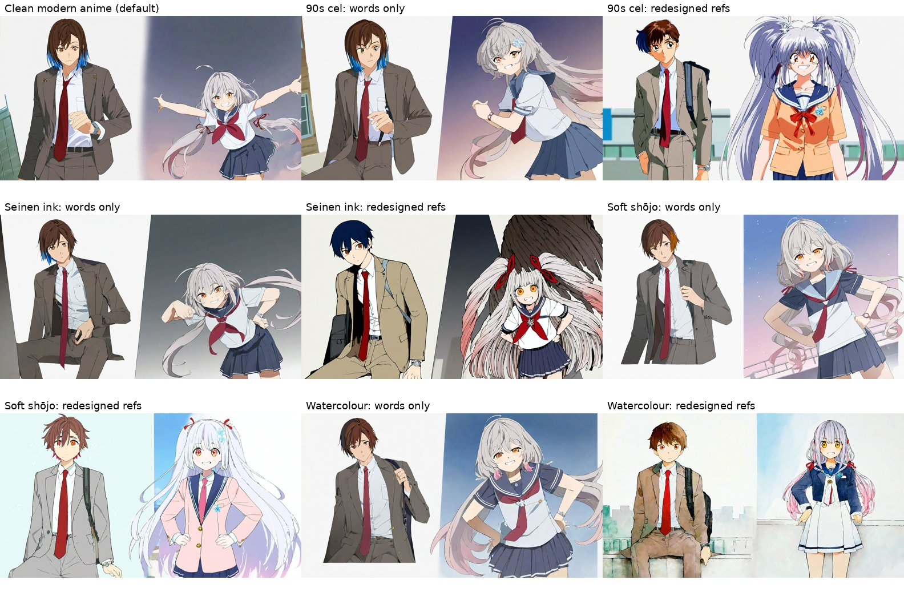
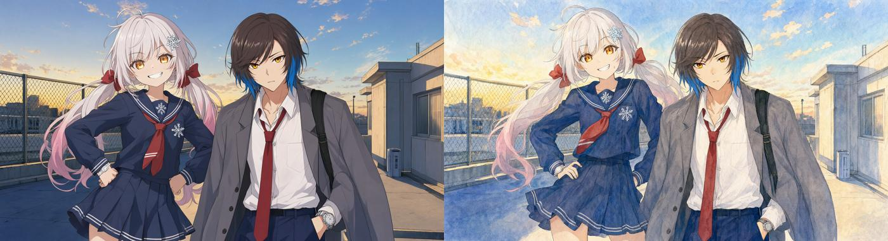

# Project styles — 2026-10-08

Can a project choose its look (90s cel, seinen ink, shōjo, watercolour), and do the models
keep to it? Four presets were measured on the rooftop suite (SDXL/NoobAI, 8 seeds, 40
renders each) two ways: with the style's words only, the characters' references still
drawn in the default look; and with Akira and Yuki redesigned in the look (traits kept).



## How

- `config/styles/presets.yaml`: per preset, Danbooru tags for SDXL, a sentence for the
  prose engines (Qwen-Image, Z-Anime, location images), negatives, and `check` tags the
  eval tagger should see when the look shows. `styles.apply` adds them to the colour
  style; it never replaces it (still colour-only, `docs/color-policy.md`).
- Every render, inpaint, character design and location design carries the project's
  `style`. Character designs get the tags too: that is where they take hold (below).
- `manganation eval run … --style ID` renders in a look and adds a `style` check, kept
  out of the accuracy score so looks compare on accuracy alone.
- Two further measures, for looks the tagger has no tag for: mean colour saturation and
  brightness (HSV), and which tags rise against the default run.

## Measured

| Look | References | Accuracy | Head count | Identity | Look's tags seen | Saturation | Brightness |
|---|---|---|---|---|---|---|---|
| Default | default | **83%** | 72% | 91% | — | 0.19 | 0.69 |
| 90s cel | default | 76% | 45% | 83% | 15% | 0.23 | 0.69 |
| 90s cel | **in the look** | 71% | 62% | 79% | **100%** | 0.22 | 0.78 |
| Seinen ink | default | 78% | 52% | 85% | 0% | 0.14 | 0.65 |
| Seinen ink | **in the look** | 76% | 92% | 85% | 0% (no tag) | 0.14 | 0.71 |
| Soft shōjo | default | 83% | 85% | 90% | 18% | 0.15 | 0.78 |
| Soft shōjo | **in the look** | **84%** | **98%** | **94%** | 32% | 0.11 | 0.88 |
| Watercolour | default | 82% | 68% | 91% | 0% | 0.18 | 0.73 |
| Watercolour | **in the look** | 82% | 92% | 91% | 12% | 0.17 | 0.83 |

Accuracy is the share of the suite's checks passed (head count, scene tags, forbidden
tags, figures, each character's identity on their own crop). Noise: two standard
errors of the per-image score over the default run's 40 renders is ±3 points, so 83%
vs 84% or 82% is no difference, and 71–78% is a real drop.

## Findings

1. **The references decide the look.** With references in the default look, style words
   barely moved SDXL: the look's tags were seen in 0–18% of renders and, by eye, the
   pages are the default look (watercolour: no wash anywhere). IP-Adapter carries the
   reference's look into every panel and outweighs the prompt.
2. **Redesigned in the look, every preset shows on every panel**, by eye on all 40
   renders of each run, and the pages read as one style. The tagger confirms 90s cel
   (retro artstyle 0% → 100%, 1990s style 0% → 88%); the other looks show partly in
   tags (sparkle, watercolour) and plainly in colour: shōjo and watercolour panels are
   brighter (0.69 → 0.88 / 0.83), seinen and shōjo less saturated. The design is where
   the tags take hold: it has no reference pulling against it.
3. **The cost is the characters' details, and it differs per look.** Shōjo and
   watercolour keep the default's accuracy. 90s cel loses 12 points: Akira's hair goes
   mostly blue, he gains glasses, Yuki's sailor uniform becomes an orange blazer. Seinen
   loses 7: Akira's brown hair goes black or navy. A redesign re-renders the character
   from their traits, and each look reinterprets them; the drift is in the new reference
   and every panel copies it. Check the redesigned references before a chapter.
4. **A look can bring things of its own.** Seinen's first redesign gave Yuki black wings
   and tentacles (its hatching and high-contrast tags read as dark fantasy), and every
   two-shot copied them. The preset's negative now refuses wings, tentacles, horns and
   monsters, and a look's negatives now reach character designs too; rerun, the wings
   were gone from the reference, with faint red feather shapes in 2 of 8 two-shots.
   The seinen row above is the rerun.
5. **Head count rose with redesigned references** (72% → 92–98%, except 90s cel 62%),
   the first time it has moved this much. The redesigned sheets were new seeds as well
   as new looks, so this may be the references, not the looks; worth its own run.

## Decisions

- Keep all five presets; GIMP shows each one's measured line (`measured` in the
  presets file).
- Changing the look offers to redesign every designed character and location, since
  without that the look does not show. Traits are kept; earlier designs stay as
  versions.
- Seinen has no `check`: the tagger has no tag for flat muted ink (no hatching
  appeared). Its measure is saturation.
- On Qwen-Image a look needs no redesign; GIMP still offers one, which keeps the
  references in the look should the project go back to SDXL.

## Qwen-Image

Qwen-Image 2.1 reads the look as a sentence, and it follows it **without redesigned
references**. Watercolour, words only (characters and the rooftop location still in the
default look), 4 seeds, 20 renders each:

| Look | Accuracy | Head count | Identity | Brightness | Saturation |
|---|---|---|---|---|---|
| Default | 86% | 65% | 92% | 0.56 | 0.27 |
| Watercolour, words only | **86%** | 70% | 92% | 0.73 | 0.24 |



Every panel is painted, with paper texture and washes, the composition and the
characters unchanged; accuracy is the same. The tagger saw no `watercolor (medium)` here
either, so its 0% says little for this look; by eye and by brightness it is plain.
Qwen's references are images in the prompt, described as "take only the face, hair and
outfit", not an adapter that carries the whole picture, so the look comes from the
words. Only watercolour was run on Qwen (4 seeds); the other looks are not measured
there.

## Reproduce

```bash
uv run manganation eval run config/eval/rooftop.yaml --label style-default
uv run manganation eval run config/eval/rooftop.yaml --style watercolor --label style-watercolor
# references in the look: copy projects/_gimp_smoke, redesign Akira and Yuki with
# design_character(..., redesign=True, style={"preset": "watercolor"}), point a copy of
# the suite's `identity` at it, and run the same command
```
